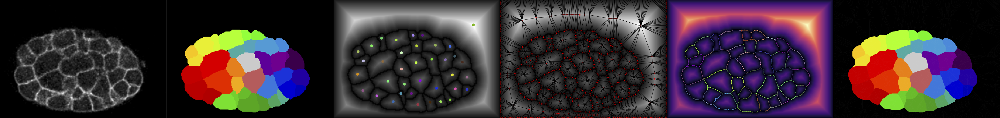

# Delaunay-Watershed 2D


**Delaunay-Watershed-2D** is an algorithm designed to reconstruct a sparse representation of the geometry of tissues and cell nuclei from instance segmentations, in 2D. It accomplishes this by building multimaterial meshes from segmentation masks. These multimaterial meshes are perfectly suited for **storage, geometrical analysis, sharing** and **visualisation of data**. We provide high level APIs to extract geometrical features from the meshes, as well as visualisation tools based on matplotlib (2D).
Our multimaterial mesh is implemented using a [Half-Edge](https://en.wikipedia.org/wiki/Doubly_connected_edge_list) data structure.


Delaunay-Watershed was created by Sacha Ichbiah during his PhD in [Turlier Lab](https://www.turlierlab.com), and is maintained by Sacha Ichbiah, Matthieu Perez and Hervé Turlier. For support, please open an issue.
A preprint of the method will be published soon. If you use our library in your work please cite the paper. 

Introductory notebooks with precise use case are provided.
The algorithm takes as input segmentation masks and return multimaterial polygonal lines (2D).
The original raw images can be inserted optionaly for visualisation but are not used for the reconstruction.

This method is used as a backend for [forceviewer2d](https://www.todo), our 2D tension inference library.


### Example 

Load an instance segmentation, reconstruct its multimaterial mesh, and extract its geometry:

```shell
pip install delaunay-watershed-2d

```

```py
from dw2d import geometry_reconstruction_2d

## Load the labels
import skimage.io as io
labels = io.imread("data/Net_images/Masks/mask_Cells_3.tif")

## Reconstruct a multimaterial mesh from the labels
DW = geometry_reconstruction_2d(labels,expansion_labels=0, min_dist=5,original_image=img)
DW.simple_plot()

## Use the mesh to analyze the geometry:
Mesh = DW.return_dcel()
Mesh.compute_lengths()
Mesh.compute_angles()
Mesh.compute_curvatures()

```

### Installation

`pip install delaunay-watershed-2d`

---

### API and Documentation

#### 1 - Creating a multimaterial mesh:
The first step is to convert your instance segmentation into a multimaterial mesh

- `geometry_reconstruction_2d(labels,min_dist = 4 ,interpolation_points=10,expansion_labels = 0,original_image = None)`: 
We infer tensions ratios by inverting junctional equilibrium relations
    - `Mesh` is a `DCEL_Data` object
    - `mean_tension` has to be defined as we only infer ratio between tensions
    - `min_dist` defines the minimal distance, in pixels, between two points used for the delaunay-triangulation
    - `interpolation_points` the number of sampling points used to estimate the value of the euclidean-distance-transform on an edge during the construction of the graph.
    - `expansion_labels` can be used to expand the labels and make them touch each other.
    - `original_image` can be used for visualization purposes
    - `return DW`, an object containing visualization and export utilities

#### 2 - Visualize and export the mesh

Once a `DW` object is generated, we can use its methods the visualize and export the result: 
- `DW:`
    - `self.simple_plot()` offers a simple view of the segmentation
    - `self.extended_plot()` offers more information, but need to provide the original image
    - `self.return_mesh()` `return` (`Verts`,`Edges_multimaterial`): 
        - `Verts` is an V x 2 numpy array of vertex positions
        - `Edges_multimaterial` is an F x 4 numpy array of Edges and material indices, where at each row the 2 first indices refers to a vertex and the 2 last refer to a given material, 0 being the exterior media
    - `self.return_dcel()` return a `DCEL_Data` object, i.e a Half-edge implementation of the mesh

#### 3 - Analyze the geometry

A `DCEL_Data` object can be used to analyze the geometry:

- `DCEL_Data:`
    - `self.compute_lengths()` returns a dictionnary with the values of the lengths of every interfaces
    - `self.compute_angles()` returns a dictionnary with the values of every angles formed by the cells (in rad)
    - `self.compute_area_faces()` returns a dictionnary with the values of the area of all the cells
    - `self.compute_compute_curvatures()` returns a dictionnary with the values of the Menger curvature of all the interfaces

---
### Biological use-cases
#### Geometrical reconstruction of C.Elegans Embryo
Data from [cShaper](cao13jf.github.io/cshaperpage/)


#### Geometrical reconstruction of Cell Nuclei
Data from [dsb2018](https://www.kaggle.com/c/data-science-bowl-2018)


---


### Credits, contact, citations
If you use this tool, please cite the associated preprint: 
Do not hesitate to contact Sacha Ichbiah and Hervé Turlier for practical questions and applications. 
We hope that **Delaunay-Watershed** could help biologists and physicists to shed light on the mechanical aspects of early development.


